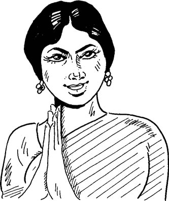

import track0101Audio from '../../../assets/audio/track-01-01.mp3?url';
import track0101Transcript from '../../../assets/audio/track-01-01.vtt?url';

import AudioTranscriptPlayer from '../../../components/AudioTranscriptPlayer.astro';
import TextGroupDisplay from '../../../components/TextGroupDisplay.astro';
import InlineLink from '../../../components/InlineLink.astro';
import { LinkCard, Card } from '@astrojs/starlight/components';

# My name is Murugan

<Card title="In this lesson you will learn to:" icon="open-book">

- use simple greetings
- introduce yourself
- use personal pronouns
- use verb forms that are appropriate to the different pronouns
- ask questions
- make requests
- express politeness

</Card>

## Arriving in Chennai

_Robert Smith, on his first visit to India, is met at Chennai (Madras) airport
by a student of a friend of his._

<AudioTranscriptPlayer
  src={track0101Audio}
  title="Arriving in Chennai"
  artist="E. Annamalai, R.E. Asher"
  poster=""
  accent="#06b6d4"
  transcript={track0101Transcript}
/>

export const groups = [
  {
    label: 'Vocabulary',
    items: [
      { primary: 'vanakkam', secondary: 'greetings' },
      { primary: 'niinga(ḷ)', secondary: 'you (plural and polite)' },
      { primary: 'peeru', secondary: 'name' },
      { primary: 'aamaa', secondary: 'yes' },
      { primary: 'naan', secondary: 'I' },
      { primary: 'taan (-daan, -ttaan)', secondary: 'emphatic word' },
      { primary: 'en', secondary: 'my' },
      { primary: 'peeraasiriyar', secondary: 'professor' },
      { primary: 'maaṇavan', secondary: 'student (masc)' },
      { primary: 'romba', secondary: 'very; very much' },
      { primary: 'konjam', secondary: 'a little' },
      { primary: 'magiẕcci', secondary: 'happiness, pleasure' },
      { primary: 'ooyvu', secondary: 'rest' },
      { primary: 'ooṭṭal', secondary: 'hotel' },
      { primary: 'ange', secondary: 'there' },
      { primary: 'vaa (var-, varu-, va-)', secondary: 'come' },
      { primary: 'poo (poog-)', secondary: 'go' },
      { primary: 'eḍu', secondary: 'take' },
    ],
  },
];

<TextGroupDisplay groups={groups} />

### Pronunciation tips

1. The intonation rises slightly at the end of the sentence when it is a question.
2. **g** between vowels is commonly pronounced **h**.
3. Vowels **i** and **e** in the beginning of a word are pronounced with a
   preceding **y** tinge (e.g. yeḍu).
4. Vowels **u** and **o** in the beginning of a word have a **w** tinge (e.g. wonga).
5. In a few phrases, **n** at the end of a word, when followed by a word
   beginning with **p**, is pronounced as **m**; e.g. **en peeru** is normally
   pronounced as **em peeru** (or even **embeeru**).
6. The word final **u** is not pronounced when followed by a vowel.

## Language points

### Greeting

**vaṇakkam** is an expression of greeting generally used in formal encounters
with elders and equals. It signifies bowing, but the physical gesture which
accompanies the expression is the placing of the palms of one’s hands together
near the chest.

### Case endings

English often relates nouns to verbs by the use of prepositions such as
‘to’, ‘in’, ‘by’, ‘of’, ‘from’. Very often, the equivalent of these in Tamil
will be a ‘case’ ending or suffix added to a noun. Two such endings are
introduced in this lesson (see the sections on ‘Genitive’ and ‘Dative’).

<LinkCard title="Genitive Case" href="/xxx/" />
<LinkCard title="Dative Case" href="/xxx/" />

### Genitive (possessive)

Pronouns of first and second person (‘I’, ‘we’, ‘you’) have two forms. One is
when they occur without any case suffix, i.e. when they occur as the subject of
a sentence. The other is when they occur with a case suffix. We shall call this
the ‘non-subject’ form. The genitive (or possessive) case suffix is -ooḍa. This
is optional for both nouns and pronouns, but you should learn to recognise it.
It is more commonly omitted with pronouns. The pronouns mentioned have the
second form (‘non-subject’) in the genitive even when the case suffix is omitted.

|                   |           |                       |                                |
| ----------------- | --------- | --------------------- | ------------------------------ |
| **niinga**        | you       | **onga**              | your (full form **ongaḷooḍa**) |
| **peeraasiriyar** | professor | **peeraasiriyarooḍa** | professor’s                    |

In phrases indicating possession, the possessor precedes the thing possessed
(as in English):

|                                |                      |
| ------------------------------ | -------------------- |
| **onga viiḍu**                 | your house           |
| **peeraasiriyarooḍa pustagam** | the professor’s book |

### Questions

The question suffix is **-aa** for questions which are answered ‘yes’ or ‘no’.
It may be added 1 at the end of the sentence; or 2 to any word (other than the
modifier of a noun) which is questioned in a sentence. Notice that in these
examples, there is nothing corresponding to the English verb ‘be’. Verbless
sentences of this sort are discussed in the next paragraph. Examples occur in
Exercises 1–3 (<InlineLink icon="pen" text="Ex 01" href="/lessons/01-exercises/#-exercise-1" />, <InlineLink icon="pen" text="Ex 02" href="/lessons/01-exercises/#-exercise-2" />, <InlineLink icon="pen" text="Ex 03" href="/lessons/01-exercises/#-exercise-3" />).

1. **niinga Murugan-aa?** Are you Murugan?
2. **niingaḷaa Murugan?** Are _you_ Murugan?

### Verbless sentences

It is not necessary that all sentences have a verb. Some sentences have as their
predicate (1) nouns or (2) other parts of speech without a verb. You will notice
that in many such instances an English sentence will have the verb ‘be’.

|                         |                       |
| ----------------------- | --------------------- |
| 1. **en peeru Murugan** | My name (is) Murugan. |
| **idu enakku**          | This (is) for me.     |
| 2. **ooṭṭal enge?**     | Where (is) the hotel? |
